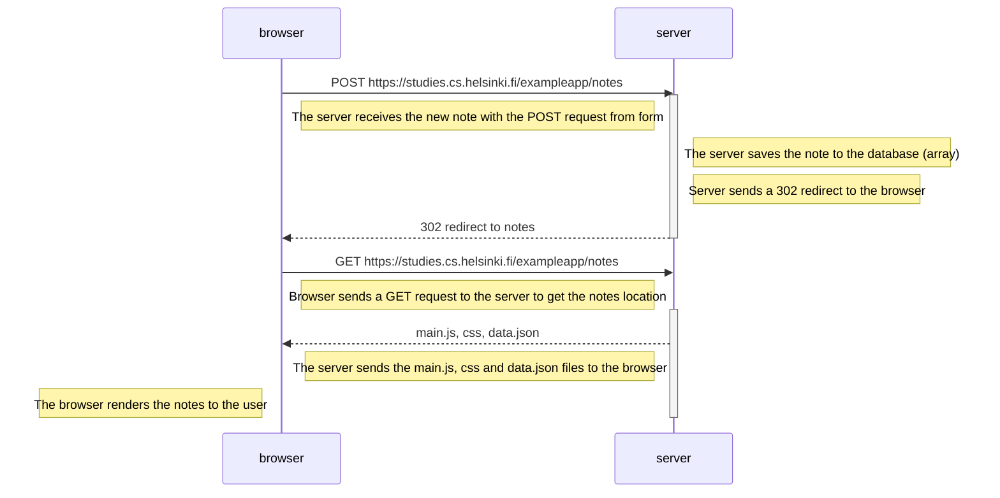

```mermaid
sequenceDiagram
    participant browser
    participant server

    browser->>server: POST https://studies.cs.helsinki.fi/exampleapp/notes
    activate server
    note left of server: The server receives the new note with the POST    request from form
    note right of server: The server saves the note to the database (array)
    note right of server: Server sends a 302 redirect to the browser
    server-->>browser: 302 redirect to notes

    deactivate server

    browser->>server: GET https://studies.cs.helsinki.fi/exampleapp/notes
    note right of browser: Browser sends a GET request to the server to get the notes location
    activate server
    server-->>browser: main.js, css, data.json
    note left of server: The server sends the main.js, css and data.json files to the browser
    note left of browser: The browser renders the notes to the user
    deactivate server


```
