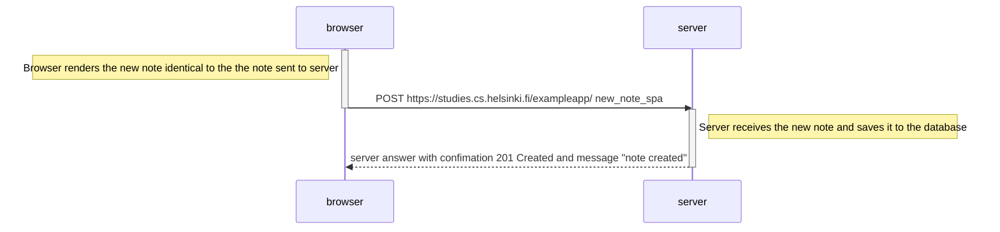

```mermaid
sequenceDiagram
    participant browser
    participant server

    activate browser
    note left of browser: Browser renders the new note identical to the the note sent to server

    browser->>server: POST https://studies.cs.helsinki.fi/exampleapp/ new_note_spa
    deactivate browser
    activate server
    note right of server: Server receives the new note and saves it to the database
    server-->>browser: server answer with confimation 201 Created and message "note created"
    deactivate server
    activate browser


```
