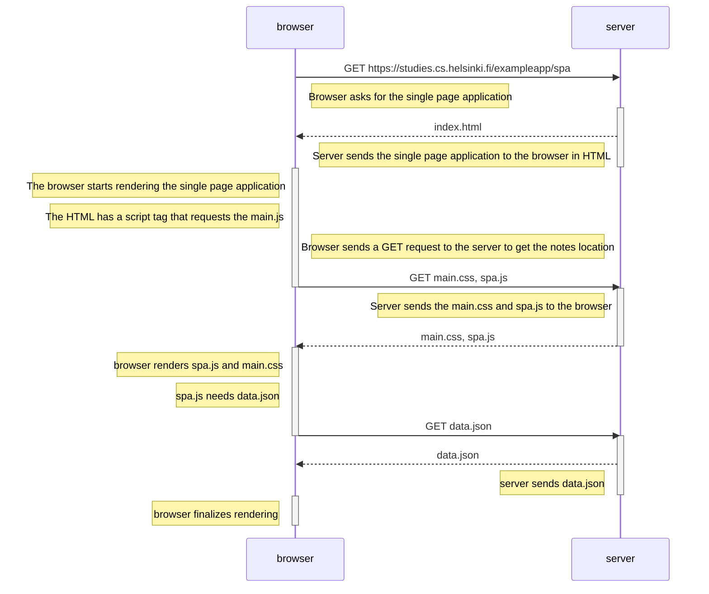

```mermaid
sequenceDiagram
    participant browser
    participant server

    browser->>server: GET https://studies.cs.helsinki.fi/exampleapp/spa
    note right of browser: Browser asks for the single page application
    activate server
    server-->>browser: index.html
    note left of server: Server sends the single page application to the browser in HTML

    deactivate server

    activate browser
    note left of browser: The browser starts rendering the single page application
    note left of browser: The HTML has a script tag that requests the main.js
    note right of browser: Browser sends a GET request to the server to get the notes location

    browser->>server: GET main.css, spa.js
    deactivate browser


    activate server
    note left of server: Server sends the main.css and spa.js to the browser
    server-->>browser: main.css, spa.js
    deactivate server
    activate browser
    note left of browser: browser renders spa.js and main.css
    note left of browser: spa.js needs data.json
    browser->>server: GET data.json
    deactivate browser
    activate server
    server-->>browser: data.json
        note left of server: server sends data.json
    deactivate server
    activate browser
    note left of browser: browser finalizes rendering
    deactivate browser


```
